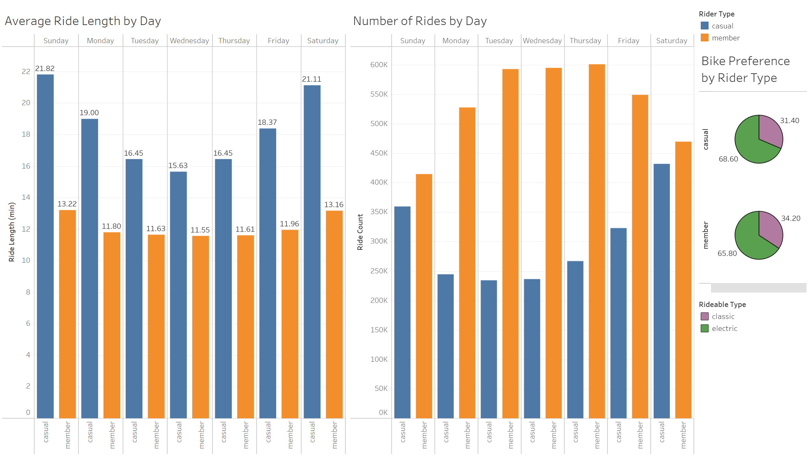

## Cyclistic Bike-Share Analysis

## Overview
Analysis of Cyclistic historical trip data to determine how casual riders and annual members use bikes differently, in order to provide the marketing team with insights to inform a membership conversion strategy.

**Tools used:** Python (pandas), Tableau Public  
**Data:** 12 months of Cyclistic trip data (July 2025 – June 2026)  
**Dashboard:** [View on Tableau Public](https://public.tableau.com/app/profile/devon.chao/viz/Rideshare_17832104407860/Sheet1)

---

## 1. Business Task
Analyze Cyclistic historical trip data to determine how casual riders and annual members use bikes differently, in order to provide the marketing team with insights to create a membership conversion strategy.

---

## 2. Data Sources
The data was obtained from Motivate International Inc. via divvy-tripdata.s3.amazonaws.com and covers 12 months of Cyclistic trip records from July 2025 through June 2026. 

---

## 3. Data Cleaning
- Removed rows with negative ride lengths (data entry errors, likely bikes pulled for maintenance)
- Removed rows with ride lengths exceeding 1,440 minutes (abandoned or unreturned bikes)
- Removed 5,896 rows with missing end coordinates
- Final dataset: 5,842,578 rows

---

## 4. Analysis Summary
Casual riders average 18.8 minutes per ride compared to 12.1 minutes for members, suggesting casual riders use bikes for leisure while members use them for short, efficient commutes. Members dominate weekday ridership with 580,000–600,000 rides Tuesday through Thursday, while casual riders peak on Saturday (431,000) and Sunday (359,000). Both rider types prefer electric bikes at roughly 69% casual and 66% member — a difference too small to be meaningful.

---

## 5. Visualizations

---

## 6. Recommendations
1. Target weekend casual riders with membership conversion campaigns — Saturday and Sunday represent the highest casual ridership volume and the clearest opportunity for conversion messaging.
2. Market the commuter value proposition — members' pattern of frequent short weekday rides suggests membership pays off for regular use, which could resonate with casual riders who commute occasionally.
3. Explore a weekend or leisure membership tier — casual riders' behavior suggests they may resist a full annual commitment but respond to a product matching how they actually ride.
